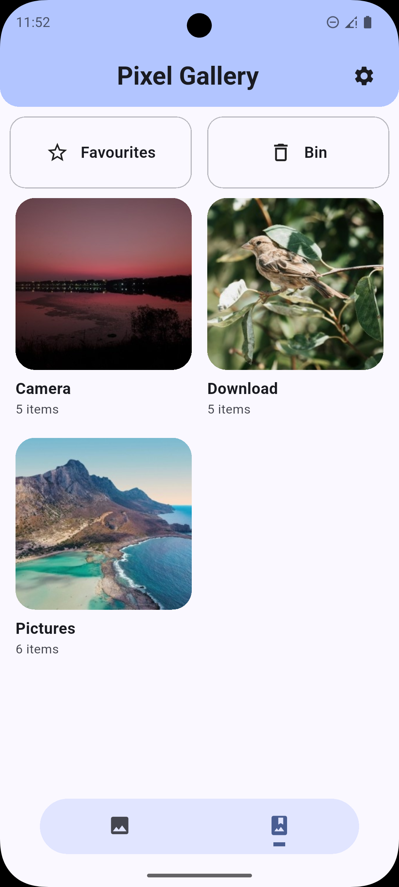
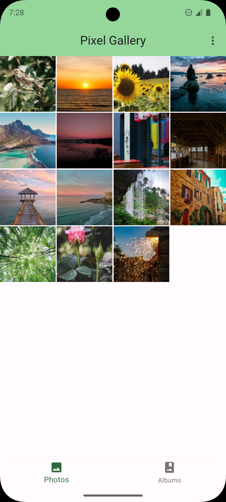
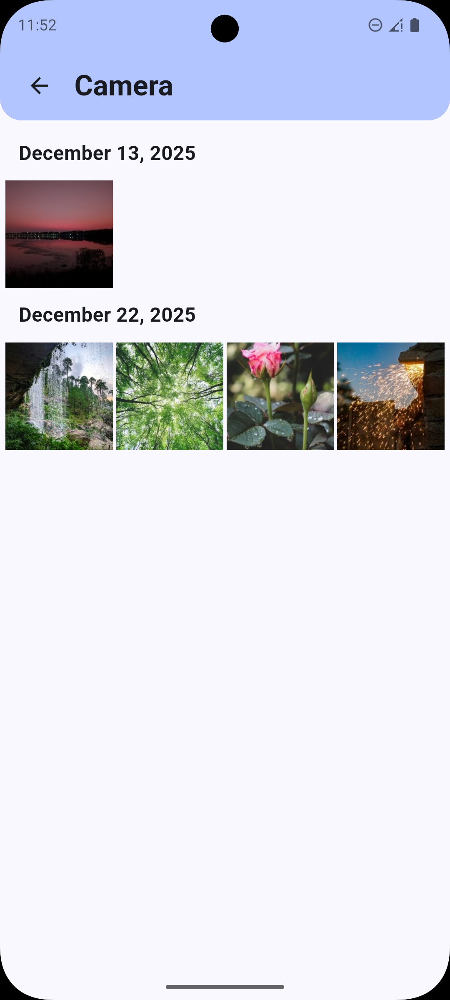
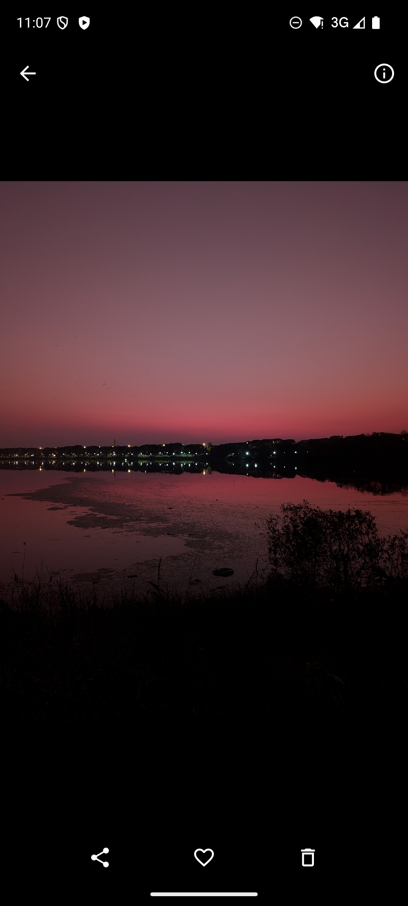
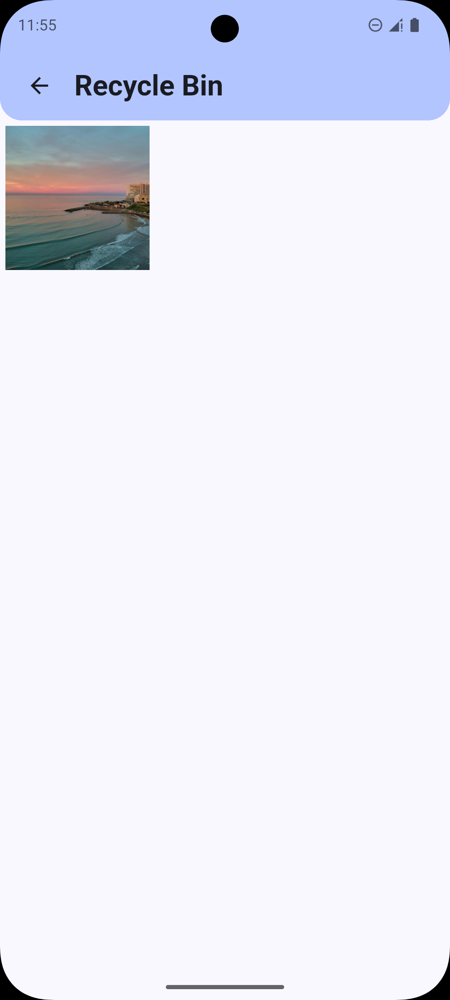
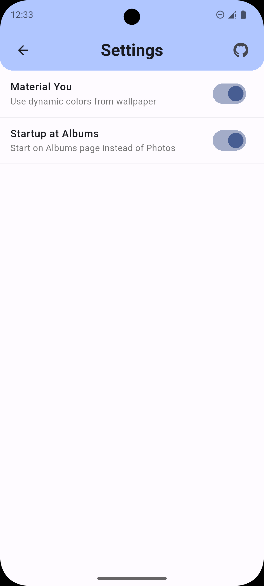

# Pixel Gallery

<p align="center">
  
</p>

<p align="center">
  <b>A privacy-first Android gallery with standard, manual multi-entry, and automatic multi-task builds.</b>
</p>

<p align="center">
  <a href="https://kotlinlang.org">
    
  </a>
  <a href="https://developer.android.com/compose">
    
  </a>
  <a href="https://github.com/JunranPei/pixel-gallery">
    
  </a>
</p>

<p align="center">
  <a href="#features">Features</a> &nbsp;•&nbsp;
  <a href="#three-release-branches">3 Release Branches</a> &nbsp;•&nbsp;
  <a href="#screenshots">Screenshots</a> &nbsp;•&nbsp;
  <a href="#installation">Installation</a> &nbsp;•&nbsp;
  <a href="#tech-stack">Tech Stack</a> &nbsp;•&nbsp;
  <a href="#contributing">Contributing</a> &nbsp;•&nbsp;
  <a href="#license">License</a>
</p>

> [!TIP]
> **The main difference between the three builds is task handling.** Branch 1 opens like a normal gallery. Branch 2 lets you create named gallery shortcuts. Branch 3 starts a separate gallery task each time you launch it.

---

## 📖 About

**Pixel Gallery** is a sleek, privacy-focused gallery application designed to provide a premium user experience. Originally built with Flutter, it has now been rewritten as a **fully native Android app** using **Kotlin** and **Jetpack Compose**. It leverages the power of **Material You** dynamic theming to adapt to your device's wallpaper, ensuring a seamless and personalized look. From managing your photo albums to viewing motion photos and map locations, Pixel Gallery creates a beautiful home for your memories.

### About This Fork

This repository is based on the original [Pixel Gallery](https://github.com/bkk31/pixel-gallery) project. The original author and contributors built the app, its design, and its core gallery features. This fork continues that work with multi-entry and multi-task builds, viewer refinements, and other changes described below.

Thank you to the original author and every contributor who made Pixel Gallery possible. Their work is the foundation of this repository.

> [!IMPORTANT]
> **Migration Notice:** Pixel Gallery is now a native Kotlin app. You can update your existing Flutter installation directly, but please keep the following in mind:
> - **Favorites will be lost:** Due to database schema changes between the Flutter and Kotlin versions, your favorites will be reset. You will need to re-favorite your images.
> - **Recycle Bin data will be lost:** Any items currently in the Recycle Bin will be removed during the update. Please restore anything important before updating.

---

## ✨ Features

- **🎨 Material You Design** - Fully adapts to your device's system colors (Android 12+).
- **📂 Smart Organization** - Automatically categorizes your media into Albums, Recents, and Videos.
- **🗑️ Recycle Bin** - Safely recover deleted photos and videos or permanently remove them.
- **🎞️ Motion Photos** - Detects and plays the video component of Motion Photos (Live Photos).
- **📍 Location Map** - View exactly where your photos were taken on an interactive OpenStreetMap.
- **📷 EXIF Details** - View detailed camera metadata (Model, Aperture, ISO, Shutter Speed).
- **⚡ Native Performance** - Built from the ground up for Android for maximum speed and efficiency.
- **🔒 Privacy First** - Your photos stay on your device. No cloud uploads, no tracking.

## 📱 Screenshots

|                              Home Screen                              |                               Photos Screen                               |                               Albums                               |
| :-------------------------------------------------------------------: | :-----------------------------------------------------------------------: | :----------------------------------------------------------------: |
|  |  |  |

|                               Viewer Screen                               |                                 Recycle Bin                                  |                                Settings                                |
| :-----------------------------------------------------------------------: | :--------------------------------------------------------------------------: | :--------------------------------------------------------------------: |
|  |  |  |

## 💾 Download now 

[](https://apt.izzysoft.de/packages/com.pixel.gallery)

## 📸 Credits

Sample photos used in screenshots are by the following authors on Unsplash:

- [Ispywithmylittleeye](https://unsplash.com/@ispywithmylittleeye)
- [Khouser01](https://unsplash.com/@khouser01)
- [Teodor Drobota](https://unsplash.com/@teodordrobota)
- [Wulcan](https://unsplash.com/@wulcan)
- [Sardar Kamran](https://unsplash.com/@sardarkamran128)
- [Fermin Rodriguez Penelas](https://unsplash.com/@ferminrp)
- [Ivan Diaz](https://unsplash.com/@ivvndiaz)
- [Gilley Aguilar](https://unsplash.com/@gilleyaguilar)
- [NordWood Themes](https://unsplash.com/@nl_lehmann)
- [Studio Mike Franca](https://unsplash.com/@studiomikefranca)
- [Chandu 029](https://unsplash.com/@chandu029)
- [Hanna Plants](https://unsplash.com/@hanna_plants)
- [Joshua Kettle](https://unsplash.com/@joshuakettle)

Icons generated using [icon.kitchen](https://icon.kitchen)

## Three Release Branches

All three branches contain the same basic gallery. The difference is whether you want one gallery task or several independent ones in Android Recents.

| Version | Branch | Compared with Branch 1 | Use it when |
| --- | --- | --- | --- |
| **Branch 1 · Standard** | [`main`](https://github.com/JunranPei/pixel-gallery/tree/main) | Normal Android app behavior. Reopening Pixel Gallery returns to the existing task. | One gallery window is enough. |
| **Branch 2 · Manual clones** | [`feature/multi-entry-alias`](https://github.com/JunranPei/pixel-gallery/tree/feature/multi-entry-alias) | Adds home-screen shortcuts that open as separate gallery tasks. Each shortcut can have its own name, icon, and starting page. | You want a few fixed entries, such as Camera, Screenshots, Favorites, or a work album. |
| **Branch 3 · Automatic clones** | [`feature-3`](https://github.com/JunranPei/pixel-gallery/tree/feature-3) | Each launch creates a new gallery task automatically. No shortcuts need to be configured first. | You often compare photos, switch between albums, or want to leave one view open while starting another. |

### Branch 2: create only the clones you need

Branch 2 adds a shortcut manager inside Pixel Gallery. A shortcut can open Photos, Albums, Favorites, Trash, or a specific album. You can give it a custom name and use the app icon, a photo, or a colored text icon.

Each shortcut has its own entry in Android Recents. For example, you can keep “Camera”, “Screenshots”, and “Work” open at the same time without turning every normal launch into another task. This suits users who want stable, recognizable entry points and control over how many clones are created.

### Branch 3: open a new copy without setting anything up

Branch 3 takes the automatic approach. Launching Pixel Gallery again creates another independent task, so the previous album or photo stays where it was. Up to 50 recent tasks are requested, although the actual number still depends on the device and Android system.

This is useful for temporary parallel browsing: comparing several photos, checking different albums, or opening a new view without losing the current position. Branch 3 can also request Notification Access for background keep-alive support. This permission is optional; the gallery still opens if you decline it.

In short: use Branch 1 for one normal gallery, Branch 2 for a small set of named clones, and Branch 3 when you want new gallery tasks on demand.

### Other Fork Improvements

The fork also includes adjustable grid density, persistent sorting, a rebuilt scrollbar with a date cursor, configurable thumbnail cache and decode settings, and improved large-image viewing. Media stays on the device; no account or cloud upload is required.


## 🛠 Installation

To build Pixel Gallery locally, you'll need [Android Studio](https://developer.android.com/studio) and the Android SDK.

1.  **Clone the repository:**

    ```bash
    git clone https://github.com/JunranPei/pixel-gallery.git
    cd pixel-gallery
    ```

2.  **Open in Android Studio:**
    Import the project and wait for Gradle sync to complete.

3.  **Run the app:**
    Click the **Run** button in Android Studio or use the command line:
    ```bash
    ./gradlew installDebug
    ```

## 🏗 Tech Stack

Pixel Gallery is built using a modern Android tech stack:

- [**Kotlin**](https://kotlinlang.org/) - Modern programming language.
- [**Jetpack Compose**](https://developer.android.com/compose) - Android's modern toolkit for building native UI.
- [**Hilt**](https://developer.android.com/training/dependency-injection/hilt-android) - Dependency injection library.
- [**Room**](https://developer.android.com/training/data-storage/room) - SQLite abstraction layer.
- [**DataStore**](https://developer.android.com/topic/libraries/architecture/datastore) - Modern data storage solution for preferences.
- [**Media3 (ExoPlayer)**](https://developer.android.com/guide/topics/media/media3) - Video playback engine.
- [**Glide**](https://github.com/bumptech/glide) - Image loading and caching.
- [**Telephoto**](https://github.com/saket/telephoto) - Zoomable image viewer for Compose.
- [**OSMDroid**](https://github.com/osmdroid/osmdroid) - OpenStreetMap integration.
- [**Metadata Extractor**](https://github.com/drewnoakes/metadata-extractor) - Comprehensive EXIF and metadata reading.
- [**Biometric**](https://developer.android.com/training/sign-in/biometric-auth) - Fingerprint and face authentication.

## 🤝 Contributing

Contributions are welcome! If you have suggestions or want to report a bug, please open an issue or submit a pull request.

1.  Fork the repository.
2.  Create your feature branch (`git checkout -b feature/amazing-feature`).
3.  Commit your changes (`git commit -m 'Add some amazing feature'`).
4.  Push to the branch (`git push origin feature/amazing-feature`).
5.  Open a Pull Request.

## 🙏 Acknowledgements

In the older Flutter versions of Pixel Gallery, a significant portion of the backend logic, particularly for media handling and metadata extraction, was inspired by the [Aves](https://github.com/deckerst/aves) project. Aves is a beautiful and feature-rich gallery and metadata explorer for Android, and its source code was invaluable to the development of those versions.

The original Aves project is licensed under the [BSD 3-Clause "New" or "Revised" License](https://github.com/deckerst/aves/blob/main/LICENSE). We are immensely grateful to the Aves contributors for their work on the original foundations.

## 📄 License

Distributed under the GNU Public License GPL-3. See `LICENSE` for more information.

